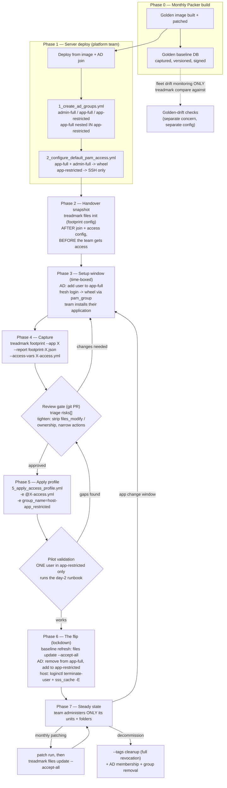
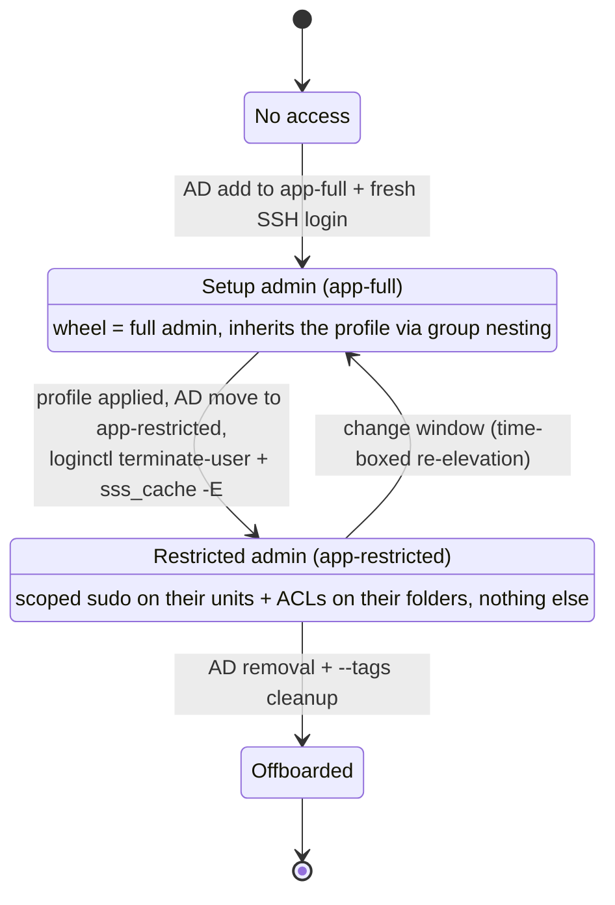

# Application deployment lifecycle — from server handover to restricted admin

This is the end-to-end operating model for deploying an application to a Linux
server and ending with the team's access limited to **exactly what they
installed**. It ties together the monthly Packer builds, the per-server AD
groups, treadmark's install footprints, and the `declarative_access` role.

> Operator runbook: phases 4–10 are packaged as the step-by-step
> [`lockdown` skill](../.claude/skills/lockdown/SKILL.md) — capture, review,
> apply, verify, flip, revoke.

The two AD groups involved (created per server by
`playbooks/1_create_ad_groups.yml`):

| Informal name | AD group | Access while a member |
|---|---|---|
| **app admin** | `{hostname}-app_full` | Full admin: mapped to `wheel` via pam_group + SSH |
| **restricted admin** | `{hostname}-app_restricted` | SSH + whatever the applied application profile grants |

One design detail does a lot of work here: **`app-full` is nested inside
`app-restricted` in AD** (playbook 1 sets this up). Anything applied to
app-restricted — ACLs, sudoers, the whole profile — is inherited by app-full
members immediately. So the profile can be applied *while the team still has
full admin*, and the final "flip" only removes wheel; it never interrupts
their scoped access.

## The lifecycle



A team member's access over time:



## Phase-by-phase runbook

| # | Phase | Actor | Action | Artifact |
|---|---|---|---|---|
| 0 | Monthly Packer build | Platform | Build image; capture + version the **golden** baseline for fleet drift (see [Baseline strategy](#baseline-strategy)) | `golden-<role>-vYYYY.MM.db` |
| 1 | Server deploy | Platform | Deploy image, AD join, `1_create_ad_groups.yml`, `2_configure_default_pam_access.yml` | 3 AD groups (nested), wheel mappings |
| 2 | Handover snapshot | Platform | `sudo treadmark files init --config /etc/treadmark/treadmark-footprint-linux.yaml` on the server | Footprint baseline DB |
| 3 | Setup window | AD admin + app team | AD: add user(s) to `<hostname>-app_full`; user logs in fresh (pam_group is per-session); team installs the application. Keep the window short; avoid patch runs inside it if possible | Installed application |
| 4 | Capture | Platform (or team) | `sudo treadmark footprint --config … --app <app> --report footprint-<app>.json --access-vars <app>-access.yml` | Footprint JSON + access profile |
| 5 | Review gate | Platform + team lead | Commit both artifacts to git; PR review is the approval record. Triage `risks[]` (setuid, sudoers, PAM, root services); tighten per [Tightening or revoking a profile](declarative-systemd-access.md#tightening-or-revoking-a-profile) — read-only units, no ownership, narrowed actions | Approved, versioned profile |
| 6 | Apply | Platform | `ansible-playbook -i inv playbooks/5_apply_access_profile.yml -e @<app>-access.yml -e "group_name=<hostname>-app_restricted"` — team inherits it instantly via nesting | Sudoers file, ACLs, ownership, linger |
| 7 | Pilot validation | One team member | Moved to app-restricted ONLY (or a test account); runs the day-2 runbook: `sudo systemctl restart <svc>`, timer + quadlet lifecycle, `sudo journalctl -u …`, config edit, log read. Gaps → back to review | Validated profile |
| 8 | The flip | Platform + AD admin | (a) refresh baseline: `sudo treadmark files update --accept-all --config …`; (b) AD: remove user(s) from app-full, add to app-restricted; (c) enforce on host: `loginctl terminate-user <u>` (or reboot window) and `sss_cache -E` | Locked-down server |
| 9 | Steady state | App team | Scoped admin only. Monthly patching: append `treadmark files update --accept-all` to the patch automation. App changes: time-boxed re-add to app-full → repeat 3–8 (footprint shows only the new delta) | Clean audit trail |
| 10 | Decommission | Platform + AD admin | `…5_apply_access_profile.yml -e @<app>-access.yml -e group_name=… --tags cleanup` (revokes sudoers, group.conf, linger, **and ACLs**); remove AD memberships/groups | Clean host |

**The one manual piece** is the AD membership moves (steps 3 and 8b). They are
deliberate approval points today; if they become friction, a small playbook
following playbook 1's `microsoft.ad` + Vault pattern can wrap them
(add-to-app-full / flip-to-restricted) — not built yet.

**Why sessions must be terminated at the flip:** pam_group grants wheel *at
login*, and SSSD caches group membership. Removing a user from app-full does
nothing to their open SSH sessions, and a stale cache can re-grant wheel on
the next login. The flip is only real after `loginctl terminate-user` (or a
reboot window) plus `sss_cache -E`.

## Baseline strategy

Two baselines, two jobs:

| Baseline | Captured | Config | Job |
|---|---|---|---|
| **Golden** (per image) | On the Packer build, monthly | drift config (no stored content needed) | Fleet-wide drift: `treadmark compare against golden-<role>.db` — is this host still consistent with its image? (See treadmark's `docs/golden-baseline-workflow.md` for signing/versioning.) |
| **Footprint** (per server) | At handover (Phase 2), then **refreshed** after every approved change and every patch window | `treadmark-footprint-linux.yaml` (`store_content: true`, aggressive excludes) | Attribution: what did the *team* change since the last approved state? Feeds `--access-vars`. |

### Why not diff footprints against the Packer baseline directly?

It seems attractive — the monthly image already contains the month's patches —
but it has three problems:

1. **It permanently carries join/deploy noise.** Everything between image
   build and handover lands in every footprint: AD join (`sssd.conf`,
   keytabs), cloud-init, and *our own access playbooks* — which edit
   `/etc/security/group.conf` and `/etc/pam.d/sshd`, so every footprint would
   flag our deployment as `pam_modified` risks attributed to the team.
2. **Its patch level only matches the server if you re-ship the DB monthly**
   — you would be maintaining a monthly refresh cadence either way, so the
   refresh may as well happen on the server, where it also absorbs the
   join/deploy delta.
3. **Monthly patching is accounted for by the refresh step, not the image.**
   After each patch run, `treadmark files update --accept-all` folds the patched
   state into the baseline. The next footprint (say, a team's change window
   two months later) then shows *only the team's new delta* — no patch noise,
   no join noise, regardless of how many patch cycles passed.

The Packer baseline still earns its keep — as the golden-drift reference,
which is exactly what it is: "does this host match the image we built?", a
different question from "what did this team install?".

Note: `--accept-all` erases the forensic record of what changed, which is why
it belongs *after* the footprint has been captured, reviewed, and archived in
git (steps 4–5) — the accepted state is by definition the approved state.

## Testing the lifecycle — how to start

### Tier 1 — role mechanics (done)

`molecule test` already covers the role end to end on AlmaLinux 9/10:
scoped sudoers for services/timers/quadlets, ACL grant + revocation proven
with real `su` checks, ownership, idempotence. Nothing to do here.

### Tier 2 — automated end-to-end rehearsal (molecule)

The whole pipeline is automated as a molecule scenario
(`roles/declarative_access/molecule/lifecycle/`): privileged systemd-init
AlmaLinux 9 **and** 10 containers each run the real sequence — handover baseline → team
installs nginx + a timer + a quadlet → `treadmark footprint --access-vars` →
the **raw generated profile** applied through the real
`5_apply_access_profile.yml` → user flipped to the restricted group →
allowed/denied operations proven with real `sudo`/`su` → revocation via the
real `--tags cleanup` CLI path → revocation proven. This scenario is the only
test that exercises `--tags cleanup` the way operators run it.

```bash
cd roles/declarative_access
TREADMARK_SRC=/path/to/the/treadmark/repo \
DOCKER_HOST=unix://$HOME/.docker/run/docker.sock \   # macOS Docker Desktop only
molecule test -s lifecycle
```

Local-only by design: it needs the treadmark source tree mounted (`TREADMARK_SRC`),
so CI keeps running just the default scenario (`molecule test` without `-s`).
Local groups (`app-full-sim`/`app-restricted-sim`) stand in for the AD
groups — the role treats local and AD groups identically for sudoers and
ACLs; realm/pam_group are AD-specific and stay out of scope (`--skip-tags
login` in the revoke step exists only for this simulated host).

### Tier 2b — manual rehearsal on a VM (optional walk-through)

The same flow by hand, useful for demos or for exercising what the container
cannot (real SSH sessions, `loginctl terminate-user`, lingering): one
systemd-enabled EL9 VM (UTM/Vagrant/a cloud instance). Local groups stand in
for the AD groups as above.

```bash
# --- 0. VM prep (as root) -------------------------------------------------
dnf install -y podman python3 sudo acl
groupadd app-full-sim && groupadd app-restricted-sim
useradd -m -G app-full-sim dev1                  # "the app team member"
usermod -aG wheel dev1                           # simulates app-full = wheel
pip3 install treadmark                               # or copy the wheel/repo

# --- 1. Handover snapshot -------------------------------------------------
treadmark files init --config /etc/treadmark/treadmark-footprint-linux.yaml

# --- 2. Setup window: install a sample app as the team would --------------
dnf install -y nginx
cat > /etc/systemd/system/demo-maintenance.service <<'EOF'
[Unit]
Description=Demo maintenance
[Service]
Type=oneshot
ExecStart=/usr/bin/logger demo-maintenance ran
EOF
cat > /etc/systemd/system/demo-maintenance.timer <<'EOF'
[Unit]
Description=Demo nightly maintenance
[Timer]
OnCalendar=daily
Persistent=true
[Install]
WantedBy=timers.target
EOF
mkdir -p /etc/containers/systemd
cat > /etc/containers/systemd/demo-web.container <<'EOF'
[Unit]
Description=Demo web container
[Container]
Image=docker.io/library/nginx:alpine
PublishPort=8081:80
[Install]
WantedBy=multi-user.target
EOF
systemctl daemon-reload && systemctl enable --now nginx demo-maintenance.timer

# --- 3. Capture + review --------------------------------------------------
treadmark footprint --config /etc/treadmark/treadmark-footprint-linux.yaml \
  --app demo --report footprint-demo.json --access-vars demo-access.yml
less demo-access.yml        # the review gate: services, timers, quadlets,
                            # files_modify, folders, ownership

# --- 4. Apply to the simulated restricted group ---------------------------
ansible-playbook -i localhost, -c local playbooks/5_apply_access_profile.yml \
  -e @demo-access.yml -e "group_name=app-restricted-sim"

# --- 5. The flip (simulated) ----------------------------------------------
treadmark files update --accept-all --config /etc/treadmark/treadmark-footprint-linux.yaml
gpasswd -d dev1 wheel && gpasswd -d dev1 app-full-sim
usermod -aG app-restricted-sim dev1
loginctl terminate-user dev1 2>/dev/null || true

# --- 6. Verify as the restricted user -------------------------------------
su - dev1 -c 'sudo -l'                                    # only scoped grants
su - dev1 -c 'sudo systemctl restart nginx'               # allowed
su - dev1 -c 'sudo systemctl restart demo-maintenance.timer'   # allowed
su - dev1 -c 'sudo systemctl restart demo-web.service'    # allowed (quadlet)
su - dev1 -c 'sudo systemctl enable demo-web.service'     # DENIED (quadlet)
su - dev1 -c 'sudo systemctl restart sshd'                # DENIED (not theirs)
su - dev1 -c 'echo "# t" >> /etc/systemd/system/demo-maintenance.timer'  # allowed via ACL
su - dev1 -c 'cat /var/log/nginx/error.log'               # allowed via ACL

# --- 7. Revoke and verify -------------------------------------------------
# (--skip-tags login only because this simulated host has no realmd;
#  real AD-joined hosts run plain --tags cleanup)
ansible-playbook -i localhost, -c local playbooks/5_apply_access_profile.yml \
  -e @demo-access.yml -e "group_name=app-restricted-sim" \
  --tags cleanup --skip-tags login
su - dev1 -c 'sudo -l'                                    # grants gone
su - dev1 -c 'echo x >> /etc/systemd/system/demo-maintenance.timer'  # DENIED
```

What this rehearsal proves: the footprint captures the service + timer +
quadlet + folders; the generated profile applies cleanly; the restricted user
can administer exactly their units (with quadlet enable/disable correctly
absent); revocation is total. What it does *not* exercise: realm login,
pam_group wheel mapping, SSSD caching — those need Tier 3.

### Tier 3 — pilot on one real tst server

Pick one `…-tst1` server and a friendly app team; run the real lifecycle
(phases 1–8) once. Measure:

- **Footprint noise**: how many entries in the generated profile were *not*
  wanted at review (target: profile readable in one sitting, edits < 10 lines).
- **Profile gaps**: how many day-2 operations the pilot user couldn't do at
  validation (target: 0 by second iteration).
- **Time in app-full**: length of the setup window (target: days, not weeks).
- **Flip friction**: whether session termination / cache flush actually
  removed wheel (verify with `id` after re-login).

Success = one full cycle where the team signs off on their restricted access
and the audit trail (footprint JSON + profile PR + applied state) is complete.
Then roll the process into the standard deployment runbook.

## Related docs

- [applications/](applications/README.md) — per-application deployment guides
  (httpd, and a menu of dnf web servers + databases), each grounded in a real
  footprint and written for a college-freshman-or-up reader
- [declarative-systemd-access.md](declarative-systemd-access.md) — the
  capture→profile→apply pipeline, contract reference, security tradeoffs,
  tightening/revoking
- [example-usage.md](example-usage.md) — playbook usage patterns
- treadmark `docs/golden-baseline-workflow.md` — golden baseline versioning,
  signing, and fleet drift checks
- treadmark `docs/footprint-workflow.md` — footprint capture details and the
  install-time caveat
