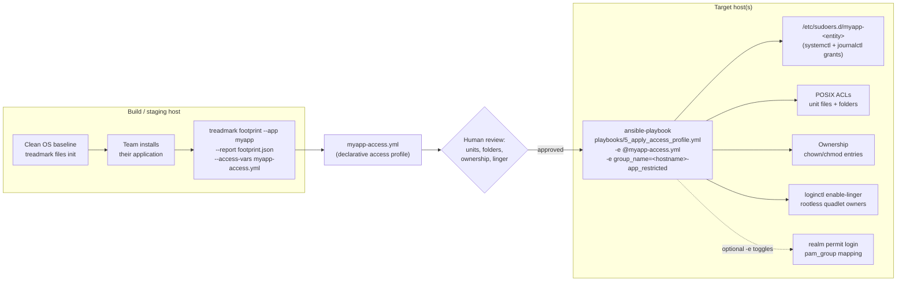
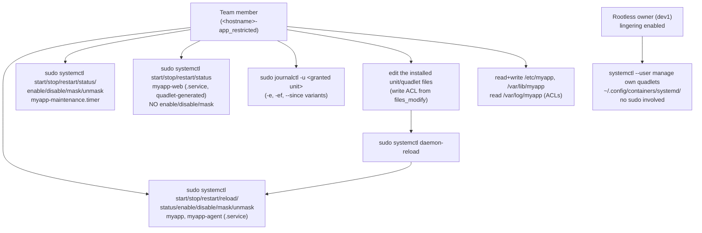

# Declarative systemd access — from install footprint to scoped admin

This is the end-to-end workflow for limiting a team's administrative access to
**exactly what their install created**: the systemd services, timers, and
podman quadlets they set up, and the folders that got created — nothing else.

The pipeline has two halves:

- **[treadmark](https://github.com/mcowser-p/treadmark)** captures an *install
  footprint* (a diff of everything an install changed against a clean
  baseline) and exports a **declarative access profile** — an Ansible vars
  file (`treadmark footprint --access-vars`).
- **This collection (`mcowser_p.declarative_access`)** applies that profile with the
  `declarative_access` role: scoped sudoers grants, POSIX ACLs, ownership,
  and lingering for rootless services.

The profile describes **WHAT** was installed. **WHO** gets the access (an AD
group or user) is passed at apply time and never stored in the profile.

The full server/AD operating model around this pipeline — monthly Packer
builds, the handover baseline, the app-full setup window, the review gate,
and the flip to restricted admin — is documented in
[application-deployment-lifecycle.md](application-deployment-lifecycle.md).

## Workflow



Step by step:

1. **Baseline** a clean host (or rootfs) before the team touches it:
   `sudo treadmark files init --config treadmark-footprint-linux.yaml`
2. **Install**: the team installs their application — services, timers,
   quadlets, config/state/log directories, service accounts.
3. **Capture + export**:

   ```sh
   sudo treadmark footprint --config treadmark-footprint-linux.yaml \
       --app myapp --report footprint-myapp.json \
       --access-vars myapp-access.yml
   # or later, from an archived footprint:
   treadmark access-vars footprint-myapp.json -o myapp-access.yml
   ```

4. **Review** `myapp-access.yml` (it is deliberately small and diffable —
   see the contract below, and the security tradeoffs section for what you
   are signing off on). `examples/myapp-access.yml` shows the exact shape.
5. **Apply** with the entity decided at apply time:

   ```sh
   ansible-playbook -i inventory playbooks/5_apply_access_profile.yml \
       -e @myapp-access.yml -e "group_name=<hostname>-app_restricted"
   ```

6. **Remove** later with the same inputs plus `--tags cleanup`.

## What each grant permits on the target



## The vars contract (what treadmark emits, what the role consumes)

| Key | Role behavior | Artifact on target |
|---|---|---|
| `declarative_access_profile_name` | Prefixes the sudoers filename; isolates profiles per entity | `/etc/sudoers.d/<profile>-<entity>` |
| `declarative_access_sudo` | Enables the sudoers feature (emitted only when unit lists are non-empty) | — |
| `declarative_access_services` | Bare service names → full systemctl action set (bare + `.service` forms) + journalctl variants | sudoers command grants |
| `declarative_access_timers` | Bare timer names → systemctl actions on `<name>.timer` (explicit suffix; no `reload`) + journalctl | sudoers command grants |
| `declarative_access_quadlets` | Generated-service base names (`foo.container`→`foo`, `foo.pod`→`foo-pod`) → **lifecycle-only** actions (start/stop/restart/status) + journalctl | sudoers command grants |
| `declarative_access_linger` / `_linger_users` | `loginctl enable-linger` for each rootless quadlet owner | `/var/lib/systemd/linger/<user>` |
| `declarative_access_files_modify` | Write ACL (`rw`) on the installed unit/quadlet files | POSIX ACLs |
| `declarative_access_folders_modify` | Recursive `rwX` ACL + default ACL | POSIX ACLs |
| `declarative_access_folders_read` | Recursive `rX` ACL + default ACL | POSIX ACLs |
| `declarative_access_ownership` | `chown`/`chmod` per entry `{path, owner, group, mode, recurse}` — path may be a **file or folder**; hand-authorable | Unix ownership/mode |
| `declarative_access_user` / `_group` | **Never in the profile.** Passed at apply time (`-e group_name=…` / `-e user_name=…`); the role requires exactly one | — |

Derivation notes (treadmark side):

- Unit names come from `services.systemd_units` / `services.quadlets` in the
  footprint; template units (`foo@.service`) and user-scope units are excluded.
- Folders come from the install's created directories (config/state/opt/srv/
  cache → modify; logs → read) **plus** systemd directives (`StateDirectory=`,
  `ConfigurationDirectory=`, `CacheDirectory=`, `LogsDirectory=`) — those
  directories are created at first service start and often absent from the
  install diff.
- Ownership entries are emitted only where the captured owner/group is a
  principal the **install itself created** (`root:root` is the default and
  declaring it would be churn). Operators can add entries by hand.
- Output is deterministic: sorted, no timestamps, byte-identical re-renders.

The molecule scenario pins this contract in CI:
`roles/declarative_access/molecule/default/files/molecule-access-vars.yml`
must stay in lockstep with treadmark's exporter (pinned there by
`tests/test_accessvars.py::test_contract_shape_matches_fixture`).

## File access: pam_group and ACLs

The `declarative_access` role grants file access two ways, and the reviewed
application profiles use **both**, each where it actually works — decided per
app, verified empirically (see the per-application guides in `docs/applications/`).

- **pam_group** (`declarative_access_pam_group` + `_local_groups`) — at SSH
  login, adds the team's AD users into a *local group* (e.g. `apache`, `tomcat`)
  for the session, via `/etc/security/group.conf`. Self-maintaining: membership
  covers whatever that group owns, including files created later.

  The principal defaults to `entity@{{ declarative_access_ad_domain }}` (an AD
  user or `%group` resolved through SSSD). Setting
  `declarative_access_ad_domain: ""` writes the principal **without** a domain
  suffix, mapping a plain local user or local group instead — no AD required.
  This is how the molecule scenarios prove the mechanism behaviorally (a real
  sshd login lands in the mapped group), and it works the same on standalone
  (non-domain-joined) hosts. Run cleanup with the same `ad_domain` value the
  grant was applied with.

  Two caveats: pam_group grants membership in `pam_sm_setcred`, so it applies
  to SSH sessions only (the `sshd;!tty*;…` line scopes it) and takes effect at
  the *next* login. And on authselect-managed hosts, `authselect apply-changes`
  regenerates `/etc/pam.d/sshd` and can drop the `pam_group.so` line the role
  inserted — re-run the role afterwards, or wire the module via an authselect
  custom profile.
- **POSIX ACLs** (`declarative_access_folders_modify` / `_folders_read` /
  `_files_modify`) — grant the team's AD group access to *exactly* the named
  paths, on top of the file's normal permissions. Also self-maintaining within
  a directory: the role sets default ACLs so new files inherit the grant.
- **Ownership / setgid** (`declarative_access_ownership`) — sets a directory
  group-owned + setgid `2775`, so members of that group write there and new
  files inherit the group. This is what makes pam_group grant real *write*.

**Why both, and not just one.** We measured what service-group membership
actually grants on the stock EL packages, and on a fresh install it is very
little: config ships root-owned (often world-readable already), and state/log
dirs are `0700`/`0770`-with-`root`-group — so being in the `apache`/`nginx`/
`postgres` group grants **no write anywhere** and usually no log read. To make
group membership meaningful you must change ownership (setgid). So the profiles
split the work:

| Need | Mechanism | Why |
|---|---|---|
| Team identity + read baseline | **pam_group** into the service group | zero-setup, self-maintaining |
| Write **content / deploy** (web roots, WARs) | **setgid group-owned** dir (or the package already is, e.g. Tomcat `webapps` 0775) | writes flow through group membership; new files inherit |
| Write **config** (`/etc/httpd`, `/etc/nginx`, …) | **ACL** | grants the *team* without also letting the *service account* rewrite its own config — a setgid to the service group would do both |
| Read **logs** (`0700`/`0770` root) | **ACL** | can't sensibly `chgrp` a log dir; the group can't reach it |

**Databases are the exception — config-scoped, no pam_group by default.** The
`mysql`/`postgres` group owns the raw data files, and DB admin happens through
the SQL client, not the filesystem. So the DB profiles grant only config + logs
via ACL and do **not** add the team to the service group. The group option is
documented in each DB guide for teams that want it.

**pam_group is also used at the host level.** `playbooks/2_configure_default_pam_access.yml`
maps `<hostname>-admin_full` / `.app-full` into the local `wheel` group — that is
how setup-window admins get sudo. So pam_group runs at two layers: `wheel` for
setup admin, and the service group for restricted app access.

**Turning the group option on/off at apply time**, without editing the profile:

```bash
# add the team to a service group (e.g. for a DB, or an app whose model is group-based)
ansible-playbook -i inventory playbooks/5_apply_access_profile.yml \
  -e @myapp-access.yml -e "group_name=<hostname>-app_restricted" \
  -e enable_pam_group=true -e '{"declarative_access_local_groups": ["mysql"]}'
```

**treadmark surfaces this for you.** The footprint's `group_access` section lists
what each install-created group can already write/read, and `treadmark footprint
--access-vars` automatically routes a granted directory that such a group
already writes through `local_groups` (pam_group) instead of an ACL. So where
the vendor already made a group writable (Tomcat ships `webapps` as `0775
root:tomcat`, and even `/etc/tomcat/Catalina` is group-writable), the profile
needs **no ACL and no ownership change** — zero deviation from vendor
permissions. Only where the vendor didn't (httpd/nginx content is root-owned)
does the profile fall back to a setgid group-owned dir or an ACL.

> **A note on setgid and drift.** The setgid content dirs (e.g. `/var/www` →
> `root:apache 2775`) are a deliberate change from the vendor's shipped
> ownership, so `rpm -V` and treadmark's own drift monitoring will flag them. That
> is *intentional, reviewed* drift — record it in the golden-baseline
> accept-list (see the lifecycle doc) so it doesn't read as tampering. Prefer
> an already-group-writable dir (pam_group only, no drift) wherever the install
> provides one; use setgid only for the content dirs it doesn't.

## Rootless quadlets (user-level services)

Rootless quadlets under `~/.config/containers/systemd/` generate **user**
units, managed by their owner with no privilege grant at all:

```sh
systemctl --user daemon-reload
systemctl --user start myapp-rootless.service
journalctl --user -u myapp-rootless.service
```

The only thing the role does for them is **lingering**
(`loginctl enable-linger <owner>`): without it, the user's systemd manager —
and every rootless service under it — stops when their last session ends.
With lingering, the user manager starts at boot and keeps running.
`XDG_RUNTIME_DIR` (`/run/user/<uid>`) is created by logind for lingering
users, which rootless podman requires.

treadmark detects rootless quadlets by path (`/home/<user>/.config/containers/systemd/`,
`/root/.config/…`, `/etc/containers/systemd/users/<uid>/`) and emits the
owners into `declarative_access_linger_users`. Capturing them requires `/home`
in the treadmark config's `paths` (commented out by default).

Cleanup caution: lingering is per-user, not per-profile. `--tags cleanup`
disables lingering for the listed users, which stops **all** their rootless
services at session end — including ones other profiles rely on.

## Security tradeoffs — read before applying

- **Write ACLs on unit files are root-equivalent for that unit.** A team
  member who can edit `/etc/systemd/system/myapp.service` (change
  `ExecStart=`, drop `User=`) and run `sudo systemctl daemon-reload && sudo
  systemctl restart myapp` can execute arbitrary commands as root. This is a
  **deliberate, accepted tradeoff**: the team installed and owns the
  application. If your environment cannot accept it, make the profile
  read-only — see [Tightening or revoking a profile](#tightening-or-revoking-a-profile).
- **`daemon-reload` is system-global.** It re-runs all generators and reloads
  every unit definition. It cannot be scoped per unit; any unit grant
  includes it because edited units and quadlets take effect only after a
  reload.
- **Quadlet grants deliberately omit enable/disable/mask/unmask.** Quadlet
  services are produced by a systemd *generator* at daemon-reload; they
  cannot be enabled or disabled, and `mask` would wedge the generated unit.
  Boot behavior is controlled by the `[Install]` section *inside* the quadlet
  file (which the team can edit via its write ACL).
- **Timer grants use the explicit `.timer` suffix only.** `systemctl start
  foo` resolves to `foo.service`, so a bare-name grant would target the wrong
  unit.
- **`--tags cleanup` is a full revocation.** It removes the sudoers file,
  group.conf entries, lingering, **and the granted ACLs** (including default
  ACLs, recursively). The only thing it leaves is the parent-directory
  traverse (`rX`) entries, which are shared across profiles of the same
  entity — see [Tightening or revoking a profile](#tightening-or-revoking-a-profile).
- **Vendor-packaged units:** write ACLs on files under
  `/usr/lib/systemd/system` will make `rpm -V` report the package as
  modified. Prefer profiles whose units live in `/etc/systemd/system`.
- **Review is the control point.** treadmark derives the profile from what the
  install *did*, which is not automatically what the team *should* keep
  administering. The vars file is small on purpose — read it.

## Tightening or revoking a profile

A generated profile is a *starting point*, not a mandate. There are three
moments to remove a grant — in particular the unit-file **edit** ability
(`declarative_access_files_modify`) and the **ownership** entries
(`declarative_access_ownership`):

**1. Before apply — edit the vars file during review.** Every feature is
gated on its key, so *absent = not granted*. Delete
`declarative_access_files_modify` for read-only units (the team keeps
systemctl/journalctl but cannot edit unit files), and/or
`declarative_access_ownership` to skip the chown/chmod entries entirely.

**2. At apply time — override without touching the file.** A later `-e`
beats an earlier `-e @file`, so grants can be neutralized per run:

```bash
# Read-only units + no ownership changes, same profile file:
ansible-playbook -i inventory playbooks/5_apply_access_profile.yml \
  -e @myapp-access.yml -e "group_name=<hostname>-app_restricted" \
  -e '{"declarative_access_files_modify": []}' \
  -e '{"declarative_access_ownership": []}'

# Narrow the sudo surface the same way, e.g. a status-only profile:
#   -e '{"declarative_access_systemctl_actions": ["status"],
#        "declarative_access_timer_actions": ["status"],
#        "declarative_access_quadlet_actions": ["status"]}'
```

Note: `systemctl edit` is **never** granted — it is not in any default
action set (services, timers, or quadlets). The only edit path is the write
ACL above.

**3. After apply — revoke with cleanup.** `--tags cleanup` removes
everything the profile granted in one command: the sudoers file, group.conf
entries, lingering, **and the ACLs** — access ACLs on every listed file,
recursive access + default ACLs on every listed folder, for the entity
passed at cleanup time:

```bash
ansible-playbook -i inventory playbooks/5_apply_access_profile.yml \
  -e @myapp-access.yml -e "group_name=<hostname>-app_restricted" --tags cleanup
```

Two deliberate exceptions:

- **Parent traverse entries remain.** The apply side sets `rX` on parent
  directories (e.g. `/etc/systemd/system`); those entries are shared by
  every profile of the same entity, so cleanup leaves them. They grant
  traverse only. Remove manually if the entity has no remaining profiles:
  `setfacl -x g:<group> /parent/dir`.
- **Ownership is not reverted.** `declarative_access_ownership` applies
  state (chown/chmod); cleanup cannot know the previous owners. Re-chown
  deliberately if it must be undone.

## Variable migration (v1 → Galaxy-standard names)

All role variables are now prefixed `declarative_access_` (the ansible-lint
`var-naming[no-role-prefix]` standard, enforced in CI). This is a breaking
change for existing playbooks; the mapping:

| v1 name | new name |
|---|---|
| `login` / `sudo` / `pam_group` | `declarative_access_login` / `_sudo` / `_pam_group` |
| `user` / `group` | `declarative_access_user` / `declarative_access_group` |
| `application_profile_name` | `declarative_access_profile_name` |
| `services` / `commands` | `declarative_access_services` / `_commands` |
| `systemctl_commands` | `declarative_access_systemctl_actions` |
| `sudo_nopass` / `runas_user` | `declarative_access_sudo_nopasswd` / `_sudo_runas` |
| `sudoers_path` / `sudoers_state` | `declarative_access_sudoers_path` / `_sudoers_state` |
| `file_read` / `file_modify` / `file_exec` | `declarative_access_files_read` / `_files_modify` / `_files_exec` |
| `folder_read` / `folder_modify` | `declarative_access_folders_read` / `_folders_modify` |
| `file_ownership` | `declarative_access_ownership` |
| `read_access` / `file_modify_access` / `exec_access` | `declarative_access_acl_file_read` / `_acl_file_modify` / `_acl_file_exec` |
| `directory_read_access` / `directory_modify_access` | `declarative_access_acl_folder_read` / `_acl_folder_modify` |
| `local_groups` / `ad_domain` | `declarative_access_local_groups` / `_ad_domain` |
| `group_conf_file` / `pam_sshd_file` | `declarative_access_group_conf_file` / `_pam_sshd_file` |
| `debug` | `declarative_access_debug` |
| *(new)* | `declarative_access_timers` + `_timer_actions` |
| *(new)* | `declarative_access_quadlets` + `_quadlet_actions` |
| *(new)* | `declarative_access_linger` + `_linger_users` |

## Testing

`molecule test` (docker driver, AlmaLinux 9/10) covers the timer/quadlet/
contract scenarios end to end — sudoers content (including the *absence* of
enable/disable on quadlets), `visudo -cf` linting, real ACL behavior via
`su - test_user`, ownership, and cleanup. `login` and `linger` stay disabled
in the container runs (no realmd / systemd-logind there), so lingering is
verified at the content level only — live `loginctl` behavior needs a real
systemd host.

## Requirements

- Target hosts: EL 9/10; podman ≥ 4.4 for quadlets (`.pod` needs ≥ 5.0,
  `.image` ≥ 4.8, `.build` ≥ 5.2).
- Collection deps: `community.general`, `ansible.posix`, `microsoft.ad`.
- treadmark ≥ 0.11 (quadlet/timer capture + `--access-vars`).
